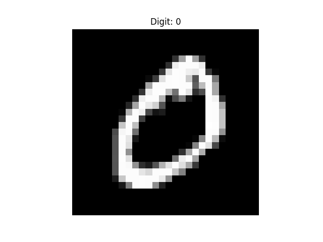
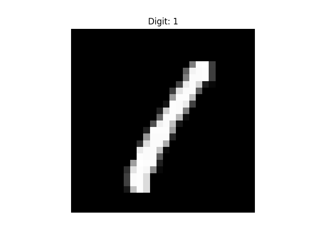
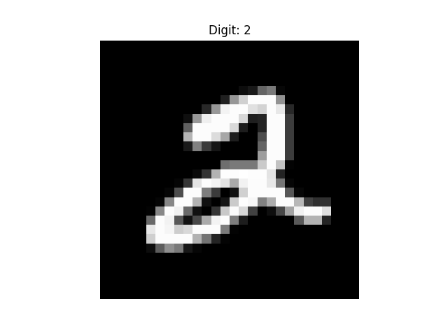
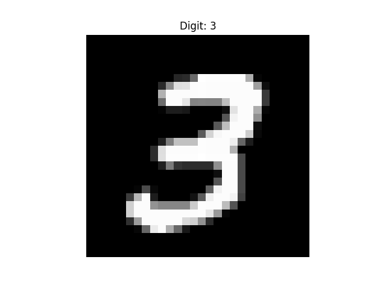
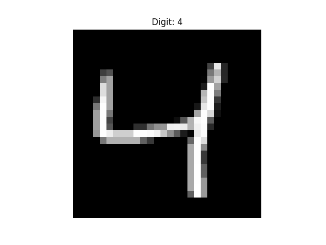
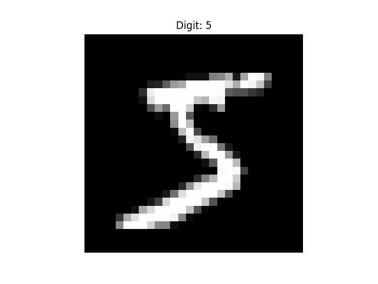
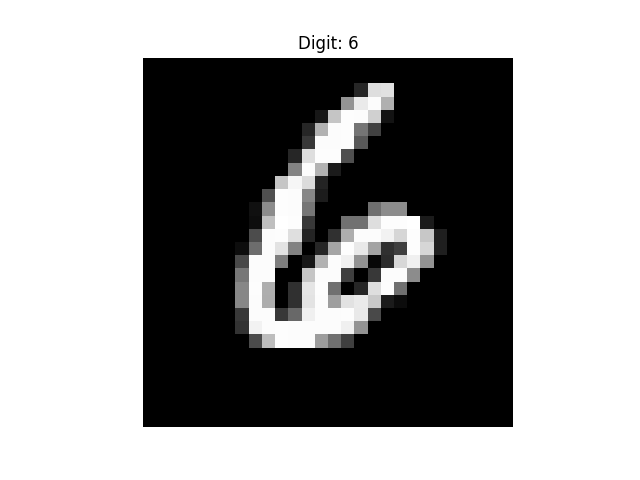
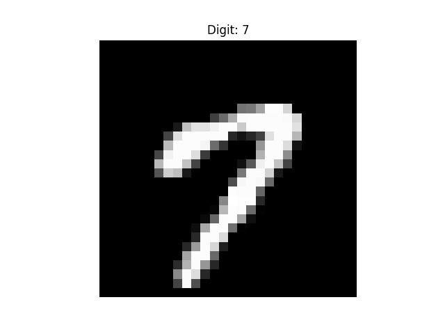
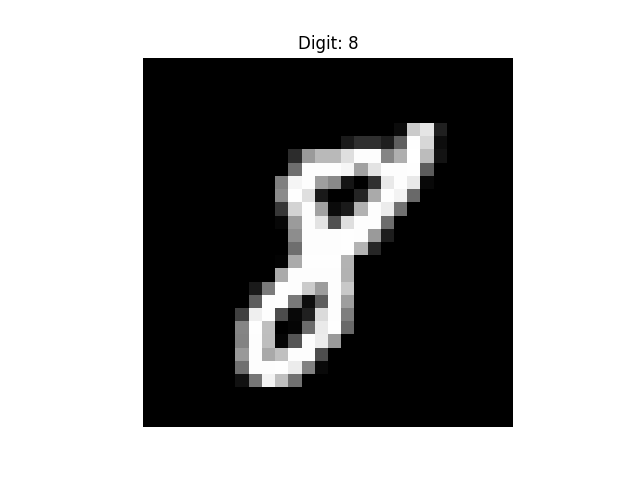
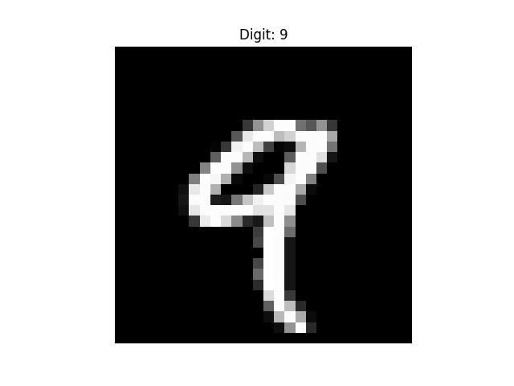

# 🧠 Handwritten Digit Recognition (MNIST)

A Machine Learning project that classifies handwritten digits (0–9).

---

## 📸 Sample Digits from Dataset

| 0 | 1 | 2 | 3 | 4 |
|---|---|---|---|---|
|  |  |  |  |  |

| 5 | 6 | 7 | 8 | 9 |
|---|---|---|---|---|
|  |  |  |  |  |

---

## 🛠️ Tech Stack
- Python
- Scikit-learn
- Streamlit
- NumPy

---

## 👩‍💻 Author
Divya Lalitha  
GitHub: https://github.com/M-Divya29
