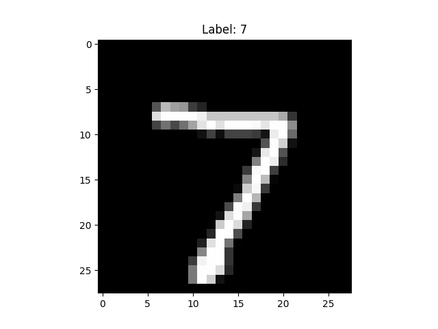

# 🧠 Handwritten Digit Recognition (MNIST)

A Machine Learning project that classifies handwritten digits (0–9) using a trained neural network model trained on the MNIST dataset.

---

## 📌 Project Overview

This project builds a digit classification system using the MNIST dataset.  
The model learns patterns from handwritten digit images and predicts the correct digit with high accuracy.

---

## 🛠️ Tech Stack

- Python
- TensorFlow / Keras
- NumPy
- Matplotlib
- Scikit-learn

---

## 📂 Project Structure

Hand-Written-Digit-Recognition/
│
├── mnist_classifier.py
├── requirements.txt
├── README.md
├── app.py
├── .gitignore
└── screenshots/

---

## 📊 Model Performance

- Dataset: MNIST (70,000 images)
- Input Shape: 28x28 grayscale images
- Output Classes: 10 (Digits 0–9)
- Accuracy: ~90%

---

## ▶️ How to Run

1. Clone the repository:

git clone https://github.com/M-Divya29/Hand-Written-Digit-Recognition.git

2. Install dependencies:

pip install -r requirements.txt

3. Run:

python mnist_classifier.py

---

## 📸 Sample Output

---

## 👩‍💻 Author

Divya Lalitha  
GitHub: https://github.com/M-Divya29
